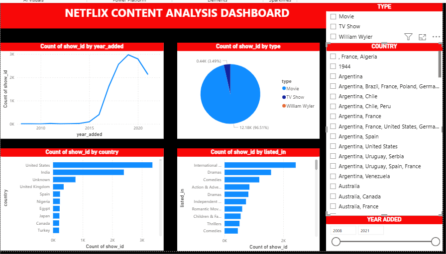

# Netflix Content Analysis Dashboard 📊

## 📌 project Overview
This project analyzes Netflix content using Power BI. The dashboard provides insights into content distribution by year, type, country, and genre.This dashboard helps understand Netflix’s global content strategy and audience targeting trends.

## 🛠️ Tools Used
- Power BI
- CSV Dataset

# 🔄 Methodology
Step 1: Data Collection
The dataset containing Netflix titles was obtained in CSV format.

Step 2: Data Cleaning
- Removed null values.
- Standardized columns (country, genre, year).
- Converted date fields into proper format.

Step 3: Data Transformation
- Extracted year_added from date.
- Categorized data into Movies and TV Shows.
- Grouped genres under “listed_in”.

Step 4: Dashboard Creation Using Power BI:
- Created line chart for yearly content growth.
- Built pie chart for content type distribution.
- Added bar charts for country and genre analysis.
- Included filters for type, country, and year.

# 📈 Key Insights
- Netflix experienced rapid growth in content addition after 2016, peaking around 2019–2020.
- Movies dominate the platform (~96%), while TV Shows represent a small portion.
- The United States is the leading content producer, followed by India and other countries.
- Drama and International genres are the most popular categories.
- Netflix has significantly expanded its global content library, indicating a focus on international audiences.
- A slight decline in content addition is observed after 2020, possibly due to external factors like production delays.

# 📊 Dashboard Overview

The dashboard provides an interactive view of:
- Content growth over time.
- Distribution by type (Movie/TV Show).
- Country-wise contribution.
- Genre-wise classification.

It enables users to filter data dynamically and gain deeper insights.

## Dashboard Preview

# ✅ Conclusion

This project successfully demonstrated how data visualization can be used to uncover meaningful insights from large datasets. By analyzing Netflix content, it was observed that the platform heavily focuses on movies and has expanded significantly in recent years, especially after 2016. The dominance of the United States and the rise of international content highlight Netflix’s strategy to cater to a global audience.

# 🙌 Learning Outcomes
- Gained hands-on experience with Power BI.
- Learned data cleaning and transformation techniques.
- Improved data storytelling and visualization skills.
- Understood real-world content trends and business insights.

